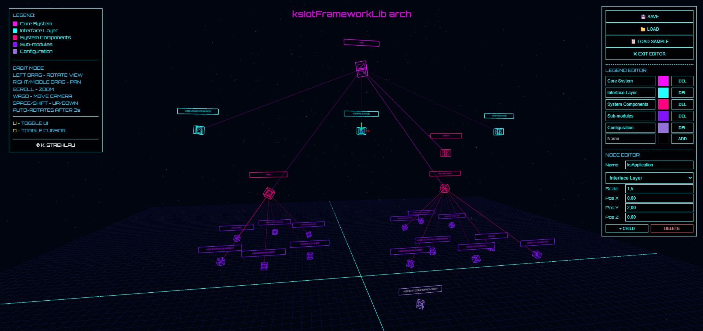

# 🖥️ ArchVis WebGL
[](https://cziter15.github.io/archvis-webgl/) [](https://github.com/cziter15/archvis-webgl)

> **ArchVis WebGL** is a small interactive WebGL-based architecture visualization built with Three.js and Vite.<br>
> Initialy vibe-coded with Claude 4.5 and GLM 4.5, then moved manually into Vite-based solution.
>
> It loads and saves architectures as XML and provides a 3D view with of it.<br>
> A sample architecture file is included for quick demos.

<p align="center">
  <a href="https://cziter15.github.io/archvis-webgl/" target="_blank">
    
  </a>
</p>



## ▶️ Quick start

Prerequisites: Node.js (16+) and npm installed.

1. Install dependencies

```powershell
npm install
```

2. Start the dev server

```powershell
npm run dev
```

3. Open the app in your browser (Vite will show the URL, commonly `http://localhost:5173`).

## 🧩 Usage 

- Click the `LOAD` button and pick an XML file that follows the project's arch XML format.
- Click `SAVE` to download the current architecture as `architecture.xml`.
- Click `LOAD SAMPLE` to load the included example architecture.
- Toggle UI: press `U`.
- Toggle cursor: press `Q`.

## 📜 Example XML

Below is the sample XML used by the app (also present in `src/main.js`):

```xml
<?xml version="1.0" encoding="UTF-8"?>
<arch>
  <node id="root" name="ROOT" pos="0,0,0" category="legend-core" scale="1">
    <node id="api-gateway" name="API Gateway" pos="10,5,0" category="legend-modules" scale="0.8">
      <node id="auth-service" name="Auth Service" pos="15,8,5" category="legend-components" scale="0.6" />
      <node id="rate-limiter" name="Rate Limiter" pos="15,8,-5" category="legend-components" scale="0.6" />
    </node>
    <node id="database-layer" name="Database Layer" pos="-10,5,0" category="legend-data" scale="0.8">
      <node id="primary-db" name="Primary DB" pos="-15,8,5" category="legend-components" scale="0.6" />
      <node id="cache" name="Cache" pos="-15,8,-5" category="legend-components" scale="0.6" />
    </node>
    <node id="workers" name="Workers" pos="0,-5,10" category="legend-modules" scale="0.8">
      <node id="job-queue" name="Job Queue" pos="5,-8,15" category="legend-components" scale="0.6" />
      <node id="worker-pool" name="Worker Pool" pos="-5,-8,15" category="legend-components" scale="0.6" />
    </node>
  </node>
  <legend>
    <entry id="legend-core" name="Core Services" color="#00ffff" />
    <entry id="legend-modules" name="Modules" color="#ff00ff" />
    <entry id="legend-components" name="Components" color="#ffff00" />
    <entry id="legend-data" name="Data Layer" color="#00ff00" />
  </legend>
  <ui-info>
    <title>MICROSERVICES ARCHITECTURE</title>
  </ui-info>
</arch>
```

## 📚 XML format notes

- Root element
  - The document root MUST be `<arch>`.

- Scene root
  - The main scene root is the first `<node>` child of `<arch>`. (Conventionally it uses `id="root"`.)

- Node elements
  - Nodes are represented by `<node>` elements and may nest arbitrarily to represent hierarchy.
  - Common node attributes:
    - `id` (optional) - unique identifier (string). Helpful for referencing nodes.
    - `name` (required) - display name (string).
    - `pos` (required) - position as three comma-separated numbers: "x,y,z". Numbers can be integers or floats. Spaces around commas are allowed but not required.
      - Example: `pos="10,5,0"` or `pos="10.0, 5.0, -2.5"`
    - `category` (optional) - the id of a `<legend><entry>` that supplies the node color. Example: `category="legend-components"`
    - `color` (optional) - hex color string that overrides category/legend color for this node. Accepts formats like `#RRGGBB` or `#RGB`.
    - `scale` (optional) - numeric scale multiplier (default is 1).
  - If both `category` and `color` are provided on a node, the node-level color takes precedence.

- Legend
  - The optional `<legend>` section contains `<entry>` elements that define named colors.
  - Each `<entry>` commonly uses:
    - `id` (required) - id used by node category attributes.
    - `name` (optional) - human-readable legend name.
    - `color` (required) - hex color string for the entry (e.g., `#ff00ff`).
  - Example:
    ```xml
    <legend>
      <entry id="legend-core" name="Core Services" color="#00ffff" />
    </legend>
    ```

- UI info
  - The optional `<ui-info>` section provides UI metadata.
  - Example:
    ```xml
    <ui-info>
      <title>MICROSERVICES ARCHITECTURE</title>
    </ui-info>
    ```
  - Unknown fields are ignored by the app.

- General notes
  - XML must be well-formed and UTF-8 encoded.
  - The loader is permissive about attribute ordering but strict about correct XML syntax.
  - If loading fails, check the browser console for parsing errors and verify attribute formats (`pos` and `color` especially).

## 🐞 Troubleshooting

- If loading fails, open the browser console to see parsing errors. The app shows brief messages in the UI as well.
- Ensure your XML is UTF-8 encoded and well-formed.
